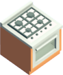

# The_Gang_Serves_Food

The Gang Serves Food is a coop networked multiplayer game where players cooperate to make and serve food to customers. It's built using the Godot Engine, and it focuses on providing a fun and interactive experience for all players.

## Table of Contents
1. [Getting Started](#getting-started)
2. [Trello](#trello)
3. [Issues](#issues)
4. [Keybinds](#keybinds)
5. [Structure](#structure)
6. [Nodes and Scripts](#nodes-and-scripts)

## Getting Started
1. Clone the repo
2. Open with Godot 4+ [Download Latest Here](https://godotengine.org/)
	- Project is currently on 4.0.2
3. Hit Player and "Host"

Running multiple instances
1. In the Editor Click Debug at the top
2. Run Multiple Instances
3. Run 2 Instances
4. Start the game
5. Move the windows so you can see
6. Host for one window
7. Join for the other window

Playing with Friends
1. Project > Export > Export Project
2. Zip the file and send to friends
3. The Host will need to run the `.console` version of the application because their public IP gets displayed in the console to give to their friends
4. Friends will join after the Host gives them their public IP to enter

## Trello
There is a [Trello board](https://trello.com/b/Kye7P3Ix/the-gang-serves-food) detailing all of the features that have been implemented or need to be implemented \ 

## Issues
There are several known issues that we're keeping an eye on related to the Godot Engine specifically:

- Watched Properties being added to Synchronizer: [Link to Issue](https://github.com/godotengine/godot/pull/75467)
	- Could tell a Synchronizer to only send updates to clients if the property changed
- Error when bringing Patties into the scene:
	- "servers/rendering/renderer_rd/storage_rd/material_storage.cpp:2849 - Condition "!material" is true."
	- Seems to be caused by setting the material Local to Scene
	- [Link to Issue 1](https://github.com/godotengine/godot/issues/67144)
	- [Link to Issue 2](https://github.com/godotengine/godot/issues/59912#issuecomment-1128091714)

## Keybinds
Gameplay Binds
- WASD movement
- Space to Jump
- Left Click to Interact
- Right Click to secondary Interact
	- Put food from a Plate onto a stove
	- Combine ingredients
	
Useful Editor Binds
- Multi-row editing: `Ctrl + Shift + Up/Down Arrow`

## Structure
### Networking
- Authority
	- Players currently have authority over themselves
		- [ ] `MultiplayerSynchronizer` syncs only Input from the Player
	- Everything else the server has authority
- `MultiplayerSpawner` uses
	- Spawns Levels
	- Spawns Players
- `MultiplayerSynchronizer` uses
	- Player to sync their position/rotations

## Nodes and Scripts

### NetworkedNode3D.gd
- extends `Node3D` \
Used for sync'ing state between players when a Player joins midsession. Any reference to `sync_state` is because of this Node. \
We can sync initial state by using a `PackedByteArray` and shoving any type of information in there, the onus is on the receiver to decode it in the correct format.
- Usage:
	- Add this `res://Scenes/networked_node_3d.tscn` scene as a child node to the node you want state to get sync'd
		- Gives this Node a `networked_id` and adds it to a `SceneIds.SCENES.NETWORKED` group
	- Override set_sync_state and get_sync_state in the parent component
		- Call `super()` to get where you left off in get_sync_state or set_sync_state
		- These are writing bytes to the Array so you need to know the sizes of the things you are writing which can be found [here](https://docs.godotengine.org/en/stable/classes/class_packedbytearray.html)
	- In the Editor set the `Scene Id` of the Interactable this is connected to and map it in `SceneIds.gd`. If your Scene doesn't exist in there then when a Player joins midsession and that object hasn't generated for them yet, it will look to that file path to create it

### Interactable.gd
- extends `Area3D` \
Base Class for all Interactables
- Usage:
	- Inherit from this class to add specific functionality by overriding `_interact` and `_secondary_interact` methods
	- Interactables are all Area3D's and need a `CollisionShape3D` to trigger Interactable events
	- They also need their Area3D Collision set to layer 3 for the Interacting Ray to pick up on it

### Rotatable.gd
- `extends Interactable` \
Simple class when interacted with will rotate a Node with Tweens
- Usage:
	- Add this `res://Scenes/components/rotatable.tscn` as a child of the Scene you want to rotate and set the target rotation

### Holder.gd
- `extends Interactable` \
Reparents Nodes when interacted with. \
- Usage:
	 1. Add this Scene `res://Scenes/components/holder.tscn` to a Scene
	 2. Add a `CollisionShape3D` to fit

### Cooker.gd
- `extends Holder` \
Calls `cook` on Cookables after a Timer ticks
- Usage:
	- Where you would put a Holder, replace it with a Cooker

### StackingHolder.gd
- `extends Holder` \
Used for holding a bunch of "stuff", like Holdables or Holders (Plates).
- Usage:
	- Add this Scene `res://Scenes/components/stacking_holder.tscn` to a Scene
	- Add a `CollisionShape3D` as a fallback collider for when there are no items and set it to Disabled by default
		- The collider will auto-enable when there are no items on the Stack so players can still put something down
	- The `StackingHolder` will accept anything it's given unless you set the `IngredientScene` in the editor
- Ex:
	- Burger Patty box where you can pull Patty's on and off the stack
	- Plate Stack where you can pull plates on and off the stack

### CombinedFoodHolder.gd
- `extends StackingHolder` \
Used for stacking together different Food ingredients \
Organizes the items by their `Food.Rule` in the Editor

### MultiHolder.gd
- `extends Holder` \
Used for things that can have multiple `Holder`'s inside a single Scene. \
When `hold_item(item)` is called on this it will delegate that to its child Holder's. \
- Usage:
	- Assign this script to the Top Level Node of the Scene
	- Add this Scene `res://Scenes/Components/HolderComponent.tscn` as a direct child of the `MultiHolder`
- Ex:
	- Plates

### Holdable.gd
- `extends Interactable` \
Node that is mostly used to sync state and call on its parent `Holder` when interacted with \
Helps distinguish when a child of a Holder is truly Holdable or some other Internal Component like a `CollisionShape3D`. \
When secondary interacted with it will attempt to Combine / Stack through the `Combiner`
- Usage:
	- Assign this script to the Top-Level Node of the Scene

### Cookable.gd
- `extends Holdable` \
Intermediary class between `Holdable` and `Food`, may be redundant \
Defines how the Holdable can be cooked
- Usage:
	- Assign this script to the Top-Level Node of the Scene

### Food.gd
- `extends Cookable` \
Class used to define a rule when stacking an item
- Usage:
	- Assign this script to the Top-Level Node of the Scene
- Ex:
	- `patty.tscn` has a rule of `SubBase` so it will go above the `bottom_bun.tscn`'s `Base`

### Combiner.gd
- static class \
This class is called on by Holdable's that are secondary interacted with to sort out the logic of whether it needs to spawn a food_combiner.tscn `CombinedFoodHolder` or continue stacking
